# ⚔️ Inventaire D&D

Une application web mobile-first de gestion de fiche de personnage et d'inventaire pour D&D 5e, entièrement en **français** avec le **système métrique**.

Gérez l'équipement, l'encombrance, les sorts, les compétences, les caractéristiques et plus encore — pour tout votre groupe, en temps réel.

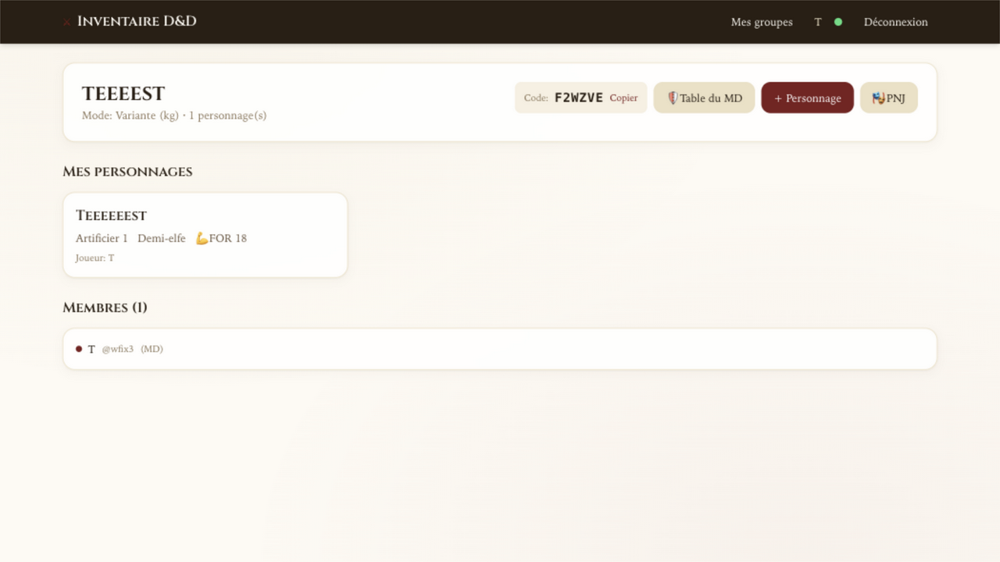

## ✨ Fonctionnalités

### 🎒 Inventaire complet
- 599 objets du SRD 5e (catalogue consultable et filtrable)
- Poids en **kilogrammes** (valeurs métriques officielles du SRD français)
- Encombrance avec barre visuelle et effets (paliers STR × 2.5 / 5 / 7.5 kg)
- Emplacements de stockage : porté, montures, conteneurs (avec poids par emplacement)
- Bourse : pièces de cuivre, argent, électrum, or, platine
- Transfert d'objets entre personnages

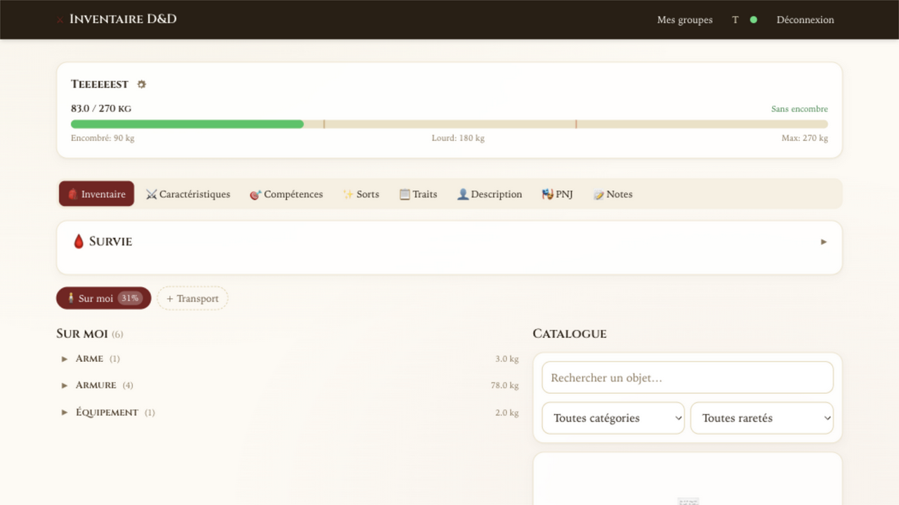
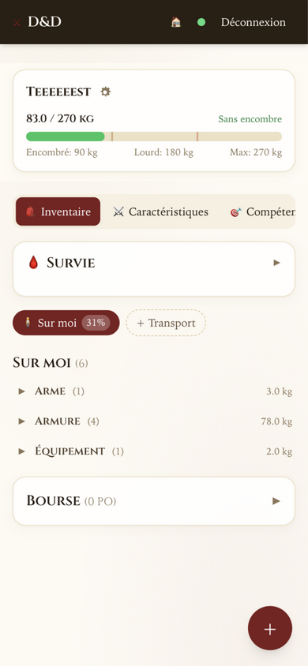

### ⚔️ Caractéristiques
- 6 scores de caractéristiques (FOR, DEX, CON, INT, SAG, CHA) avec modificateurs
- Classe, niveau, race, historique
- Stats dérivées : bonus de maîtrise, initiative, perception passive, **CA calculée** (depuis l'armure équipée + DEX), DD de sauvegarde des sorts, dé de vie

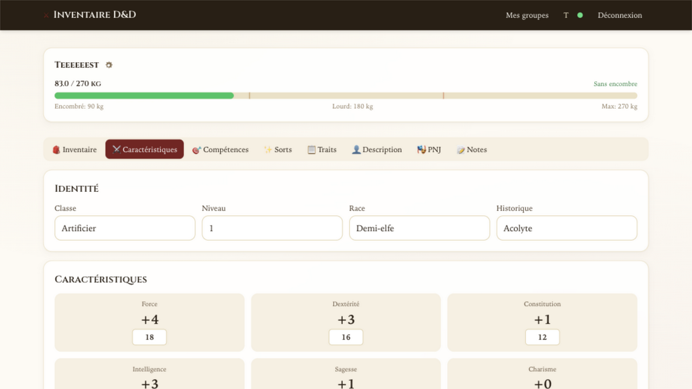

### 🎯 Compétences
- 18 compétences + 6 jets de sauvegarde
- Bascule de maîtrise en un clic (calcul automatique des modificateurs)
- Groupé par caractéristique

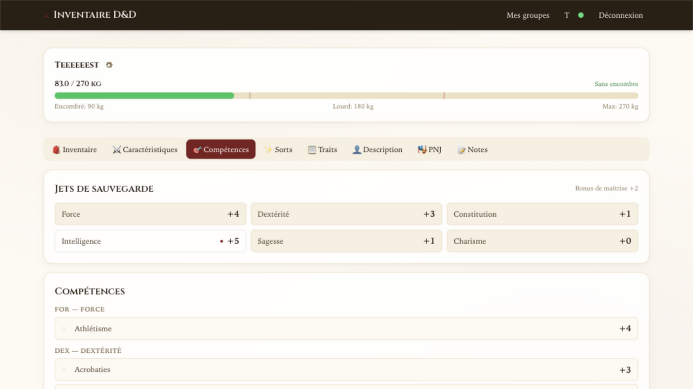

### ✨ Sorts
- **490 sorts** du SRD + extensions (Xanathar, Tasha, Fizban) — tous en français depuis AideDD.org
- Traqueur d'emplacements de sort (calculé selon la classe et le niveau)
- Liste de sorts connus/préparés avec bascule ★/☆
- Limite de préparation par classe (formule SRD officielle)
- Grimoire consultable avec filtres par classe, niveau, école
- **Badges de stats calculés** : DD de sauvegarde, bonus d'attaque, dés de dégâts (mis à l'échelle pour les tours de magie)

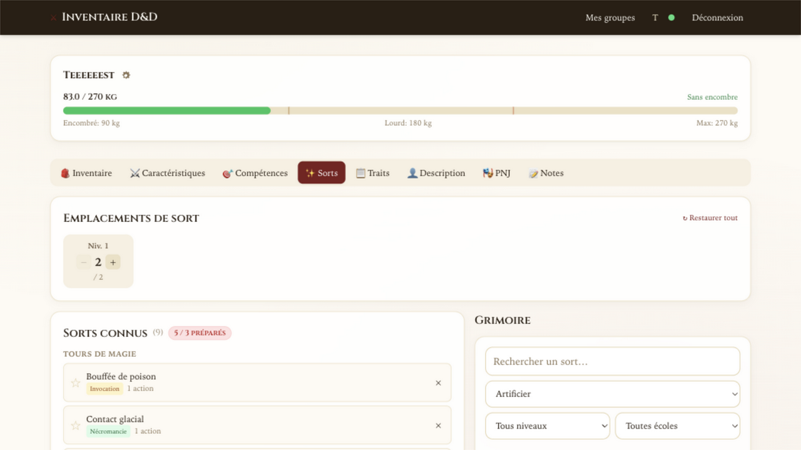
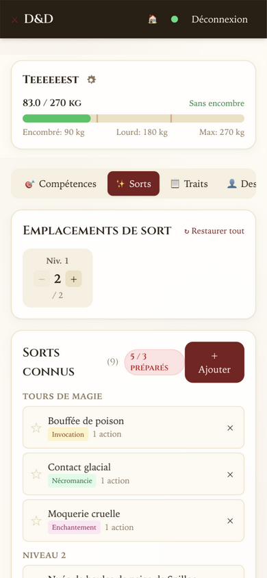

### 📋 Traits
- Capacités libres (classe, race, historique, dons, personnalisé)
- **Système de modèles** : insérez des valeurs calculées avec `{{save_dc}}`, `{{prof}}`, `{{str_mod}}`, `{{skill:perception}}`, etc.
- Aperçu en direct lors de l'édition

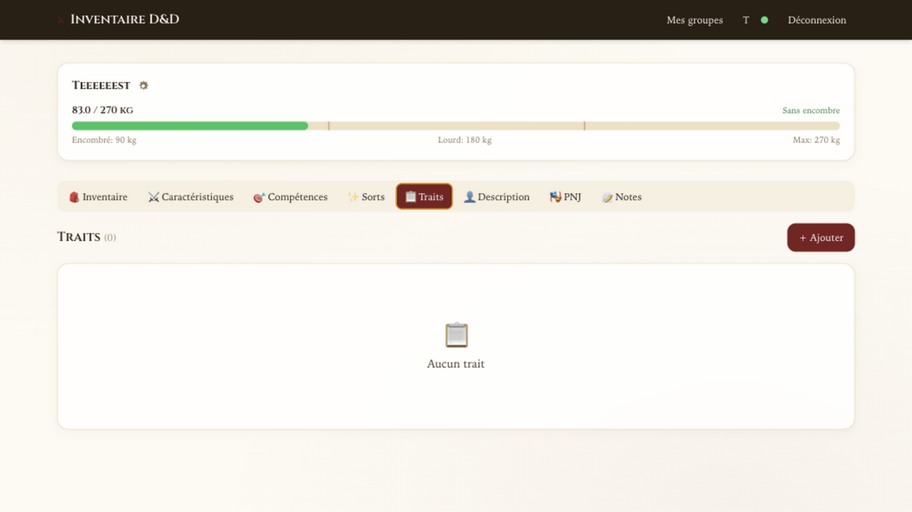

### 👤 Description
- Portrait du personnage (téléversement d'image)
- Attributs physiques : alignement, sexe, âge, taille, poids, peau, yeux, cheveux
- Personnalité : traits, idéaux, liens, défauts

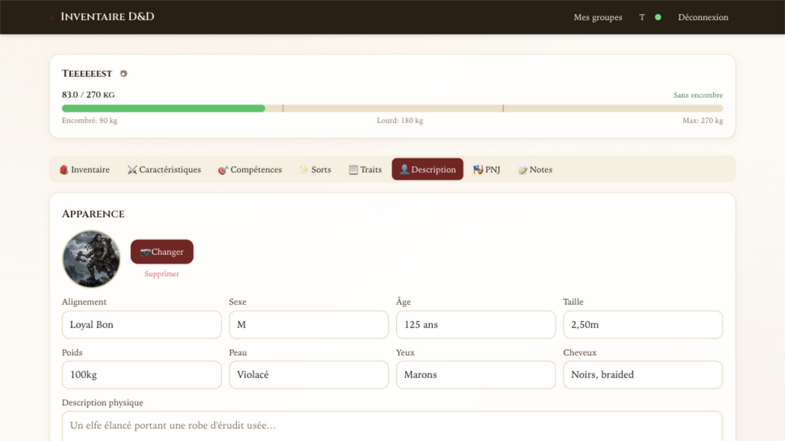

### 🎭 PNJ
- Tableau de bord des PNJ partagé au sein du groupe
- Création/édition par tout membre du groupe
- Filtres par faction, disposition, statut

### 📝 Notes
- Notes libres avec formatage Markdown simple
- Mode édition + aperçu en direct
- Idéal pour les quêtes, le lore, les rappels

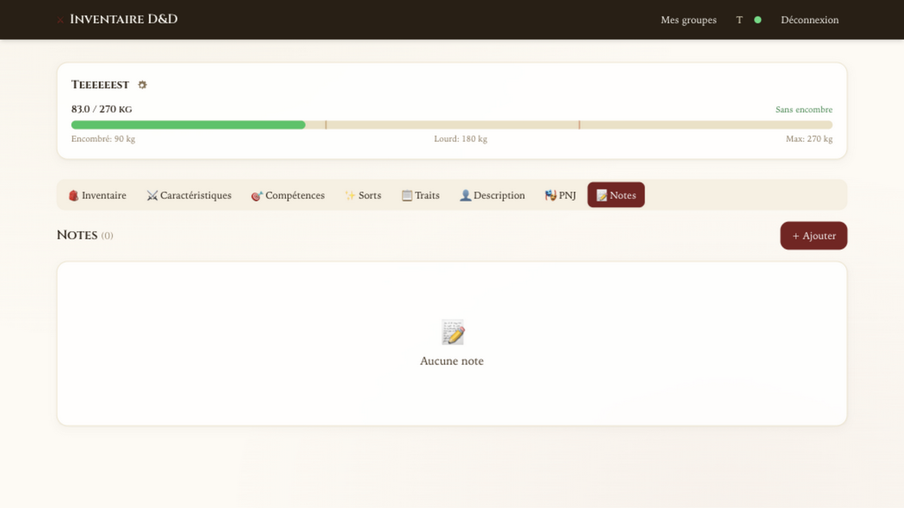

## 🏗️ Stack technique

| Couche | Technologie |
|---|---|
| Frontend | React 18 + Vite + Tailwind CSS (mobile-first, PWA) |
| Backend | Fastify 5 + better-sqlite3 (Node 20) |
| Auth | bcrypt + JWT |
| Sync | WebSocket temps réel (synchronisation chirurgicale) |
| Données | 5e SRD (5e-bits/5e-database) + AideDD.org |
| Deploy | Docker Compose multi-arch (GHCR) |

## 🚀 Démarrage rapide

### Docker (images pré-construites)

```bash
export JWT_SECRET="votre-secret-ici"
docker compose -f docker-compose.prod.yml up -d
```

- App : http://localhost:8080
- API : http://localhost:4010

### Docker (build depuis le source)

```bash
docker compose up --build
```

### Développement local

```bash
npm install
npm run import-items    # Importe le catalogue SRD (lb → kg)
npm run import-spells   # Importe les sorts SRD
npm run migrate         # Crée les tables
npm run seed            # Insère les données
npm run dev             # Démarre API + Web
```

- Web : http://localhost:5173
- API : http://localhost:4000

## 📊 Encombrance (SRD français, système métrique)

| Palier | Seuil (kg) | Effet |
|---|---|---|
| Encombré | FOR × **2.5** kg | Vitesse −3 m |
| Lourdement encombré | FOR × **5** kg | Vitesse −6 m · Désavantage FOR/CON |
| Surchargé | FOR × **7.5** kg | Immobilisé |

Poids des pièces inclus : 1 pièce ≈ 10 g (50 pièces = 0.5 kg).

## 🎭 Classes prises en charge

13 classes du SRD + extensions, avec données propres à chaque classe :

| Classe | Dé de vie | Incantation | Préparation | Source |
|---|---|---|---|---|
| Artificier | d8 | Demi (INT) | Oui | Tasha's |
| Barde | d8 | Complète (CHA) | Non | SRD |
| Clerc | d8 | Complète (SAG) | Oui | SRD |
| Druide | d8 | Complète (SAG) | Oui | SRD |
| Ensorceleur | d6 | Complète (CHA) | Non | SRD |
| Magicien | d6 | Complète (INT) | Oui | SRD |
| Occultiste | d8 | Pacte (CHA) | Non | SRD |
| Paladin | d10 | Demi (CHA) | Oui | SRD |
| Rôdeur | d10 | Demi (SAG) | Oui | SRD |
| Barbare, Guerrier, Moine, Roublard | — | Non | — | SRD |

Chaque classe calcule automatiquement : dés de vie, sauvegardes maîtrisées, emplacements de sort, DD de sauvegarde, limite de préparation.

## 🔄 Synchronisation temps réel

L'application utilise WebSocket pour synchroniser instantanément tous les joueurs connectés :
- **Suppression d'écho serveur** : l'auteur d'une action ne reçoit pas l'événement (pas de double-rafraîchissement)
- **Debounce 300ms** : les événements rapides sont coalescés (1 rafraîchissement au lieu de N)
- **Rafraîchissement silencieux** : les pages de liste ne clignotent pas (pas de spinner)
- **Garde de diff** : les réponses identiques ne déclenchent pas de re-rendu

## 📱 Mobile-first

L'interface est conçue pour mobile d'abord, avec adaptation responsive desktop :

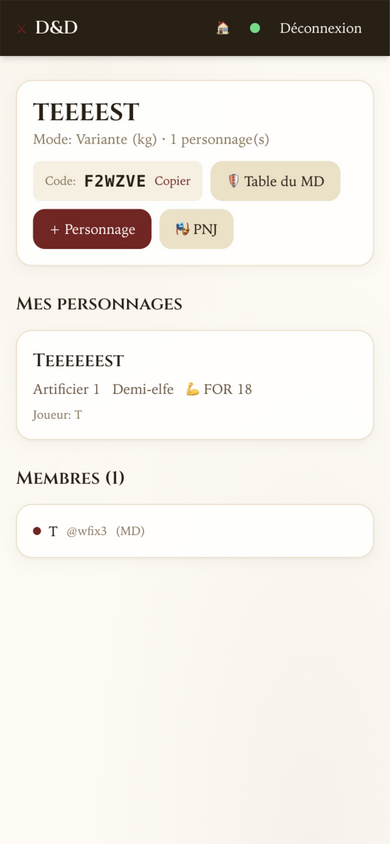
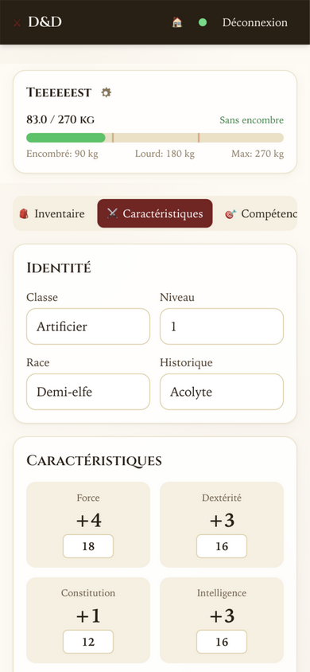

## 📜 Licence

- **Code** : MIT
- **Données d'objets** : [5e-bits/5e-database](https://github.com/5e-bits/5e-database) (MIT + OGL v1.0a)
- **Traductions françaises** : [AideDD.org](https://www.aidedd.org) / [5e-drs.fr](https://5e-drs.fr)

## 🔗 Liens

- **Dépôt** : [github.com/WazoAkaRapace/dnd-inventory](https://github.com/WazoAkaRapace/dnd-inventory)
- **Images Docker** : `ghcr.io/wazoakarapace/dnd-inventory-api:main` / `ghcr.io/wazoakarapace/dnd-inventory-web:main`
